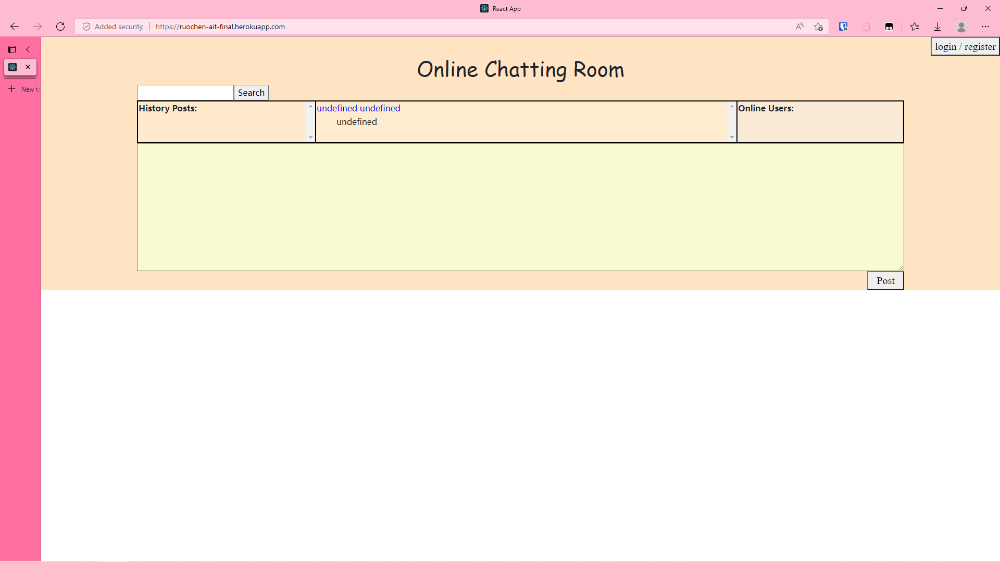

This is my final project for CSCI-UA 467 Applied Internet Technology. I built a full stack web app that allows users to register, login, see online users, send texts and images, recieve other users posts synchronously, and search for history posts.

My tech stack is MERN. Specially, I used MongoDB Atlas. I deployed the app to Heroku, the link is here: [https://ruochen-ait-final.herokuapp.com/](https://ruochen-ait-final.herokuapp.com/). Please note that due to the limitation of Heroku free plan, images uploaded to and stored in the backend in previous active cycles are automatically removed when the app is put into sleep.

# Online Chatting Room

## Overview

This app allows its users to chat with others in the chatting rooms. It supports chat history browsing and searching as well as sending images.

## Data Model

The application will store Users and Logs.

An Example User:

```javascript
{
  username: "foo",
  password: // a password hash,
}
```

An Example Log:

```javascript
{
  content: "foo",
  poster: // a reference to User objects
  time: "1111-11-11 11:11:11",
  image: // a boolean to indicate if this log is an image or not
}
```

## [Link to Database Connection & Schema](./back-end/src/db.js)

## [Link to Authentication](./back-end/src/auth.js)

## Wireframes

page where everything happens



modal for login and registration


## Site map


## User Stories or Use Cases

1. as non-registered user, I can register a new account with the site
2. as a user, I can log in to the site
3. as a user, I can post messages in the chat room
4. as a user, I can see others' posts synchronously
5. as a user, I can browse the chat history
6. as a user, I can search within the chat history
7. as a user, I can know who's in the room
8. as a user, I can send images
9. as an admin, I want to block non-logged user from online-user list and their posts

## Research Topics

* Socket.io
    * use Socket.io to "enable low-latency, bidirectional and event-based communication between a client and a server"

* multer
    * use multer to handle images uploaded by users

* user authentication
    * use passport for user authentication
    * use JsonWebToken for keeping track of user authentication status

## Link to Initial Main Project File[Frontend](./front-end/src/App.js)[Backend](./back-end/src/app.js) 

## Annotations / References Used

1. [passport.js authentication docs](http://passportjs.org/docs)[passport.js](./back-end/src/passport.js)[auth.js](./back-end/src/auth.js)
2. [React.js docs](https://reactjs.org/docs/getting-started.html)[App.js](./front-end/src/App.js)
3. [Socket.io documentaion](https://socket.io/docs/v4/)[app.js](./back-end/src/app.js)
4. [Getting Date and Time in Node.js](https://usefulangle.com/post/187/nodejs-get-date-time)
5. [How to deploy a Reactjs and Express App to Heroku](https://medium.com/@adoolak/how-to-deploy-a-reactjs-and-express-app-to-heroku-afb5b117e0eb)
6. [How To Implement API Authentication with JSON Web Tokens and Passport](https://www.digitalocean.com/community/tutorials/api-authentication-with-json-web-tokensjwt-and-passport)[passport.js](./back-end/src/passport.js)[app.js](./back-end/src/app.js)
7. [How To Upload and Serve Photos Using React, Node, Express](https://dev.to/austinbrownopspark/how-to-upload-and-serve-photos-using-react-node-express-36ii)[api.js](./back-end/src/api.js)
