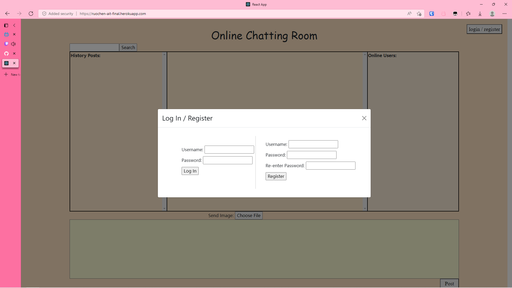

# Online Chatting Room

## Overview

This app allows its users to chat with others over the Internet in chatting rooms (a one-to-one chat is a room with two people). It allows the creator of the chatting room to manage the members, and supports chat history browsing and searching.

## Data Model

The application will store Usersand Logs.

* users can have multiple logs (via references)

An Example User:

```javascript
{
  username: "foo",
  hash: // a password hash,
  posts: //an array of references to Logs objects
}
```

An Example Log:

```javascript
{
  content: "foo",
  poster: // a reference to User objects
  time: "1111-11-11 11:11:11:111"
  ]
}
```

## [Link to Commented First Draft Schema](db.js) 

## Wireframes

/login - page for login and registration



/home - page where everything happens


## Site map


## User Stories or Use Cases

1. as non-registered user, I can register a new account with the site
2. as a user, I can log in to the site
3. as a user, I can post messages in the chat room
4. as a user, I can see others' posts instantly
5. as a user, I can browse the chat history
6. as a user, I can search among the chat history

## Research Topics

* (3 points) Socket.io
    * use Socket.io to "enable low-latency, bidirectional and event-based communication between a client and a server" (from official documents)
    * numerous tutorials available online, which ease the difficulty to learn Socket.io

* (5 points) Automated functional testing for all of your routes using any of the following:
    * Selenium
    * Minimally 4 tests
    * You'll have to link to testing code in repository
    * … and show a screen capture of tests

* (3 points) React.js
    * use React.js as the frontend framework; it's a challenging library to learn, but I won't make many pages, so I've assigned it 3 points

* (5 points) Integrate user authentication
    * I'm going to be using passport for user authentication

* (2 points) Deploy on Heroku 
    * I'm going to deploy my app on Heroku

* (1 point) MongoDB Atlas
    * I'm going to use MongoDB Atlas

19 points total out of 8 required points (I may not do all of these)

## [Link to Initial Main Project File](app.js) 

## Annotations / References Used

1. [passport.js authentication docs](http://passportjs.org/docs)
2. [React.js docs](https://reactjs.org/docs/getting-started.html)
3. [Socket.io documentaion](https://socket.io/docs/v4/)
4. [Selenium documentation](https://www.selenium.dev/documentation/)
5. [Getting Date and Time in Node.js](https://usefulangle.com/post/187/nodejs-get-date-time)
6. [How to deploy a Reactjs and Express App to Heroku](https://medium.com/@adoolak/how-to-deploy-a-reactjs-and-express-app-to-heroku-afb5b117e0eb)
